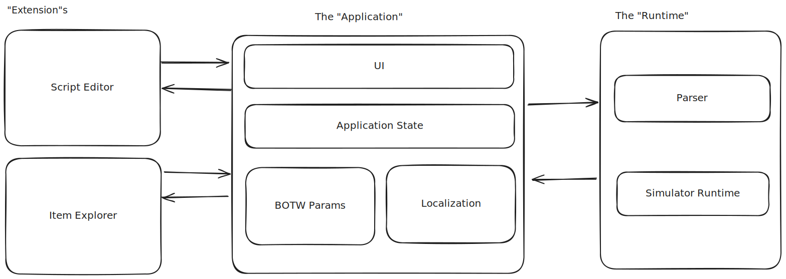

# Architecture
To get started, you must understand the architecture of the IST simulator.
This will help you find the relevant code to start digging into the project.

## The Three Parts
The simulator app can be divded into 3 distinct parts:
- The "Runtime": This is what parses the script and runs the simulation
- The "Application": This is what handles the UI, the states associated with the UI,
  and data such as item parameters and localization.
- The "Extension"s: These are individual encapsulation of some functionality that
  works with the Application. 

The relationships between the 3 parts can be summarized as:
- The Application stores the state (such as what the script is), and uses the Runtime
  to drive the simulation
- The Extensions uses the Application to access the current state and functionality
  of the Runtime
  - Note the Extensions don't talk to each other, and they don't talk to the Runtime directly.

The APIs between the 3 parts are well-defined in the [`@pistonite/skybook-api`](https://github.com/Pistonite/botw-ist/tree/main/packages/skybook-api) package.
The API library is built upon my own worker RPC library [`workex`](https://workex.pistonite.dev) and
my own TypeScript library [`pure`](https://pure.pistonite.dev).

## The Runtime
The runtime contains the very basic functionality of the simulator:
- Parsing the simulator script
- Executing the simulation

If you are looking into adding new commands, changing existing commands,
updating the syntax, or supporting the simulator script in other applications,
this is where to look.

### Parser
The [`skybook-parser`](https://github.com/Pistonite/botw-ist/tree/main/packages/parser)
package implements parsing the commands. You can use this package
to support the simulator script in other tools. For example,
the parser is used to highlight the simulator script syntax in this manual.

The parser has 2 stages: `syn` and `cir`:
- `syn` is the syntax parsing part
- `cir` stands for Command Intermediate Representation. It takes the syntax tree
  (the output of `syn` stage) and convert it to runnable commands. This process includes:
  - Resolving the item identifier (such as `royal_claymore`) and search queries to actor names
  - Parses other properties such as item metadata to ensure they are valid in the context

The parser also has an injected dependency: the `QuotedItemResolver`. This is 
used to resolve quoted item search queries such as `"Royal Claymore"`. In the simulator
web app, quoted strings are searched using the items' localized names so users can use
their native language in the script. The parser's implementation is generic and can (and must)
take an externally implemented `QuotedItemResolver`

### Runtime
TODO
